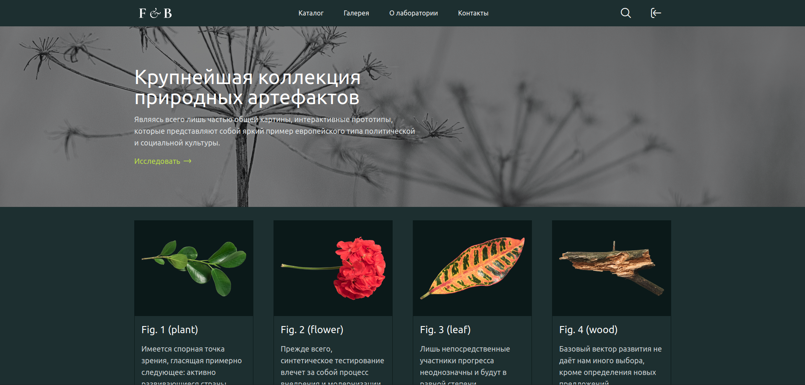
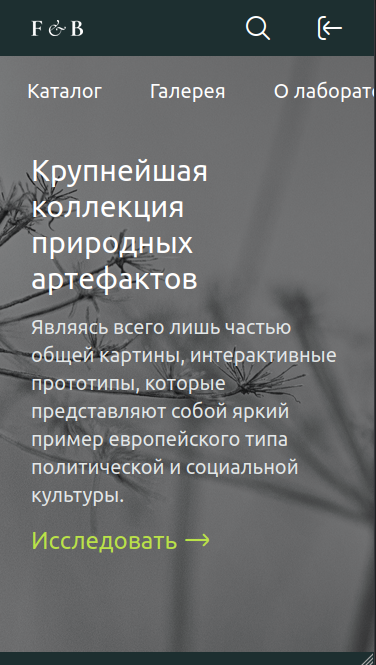

# Учебный шаблон на TailwindCSS №1

Учебный шаблон для отработки навыков верстки на фреймворке TailwindCSS.

## Превью

[GitHub Page](https://rotcetihra.github.io/study-tailwindcss-layout-1/)

Большие экраны

Мобильные устройства

## Стек

- HTML5
- TailwindCSS

## Источники

- Макет:
  [Figma](https://www.figma.com/design/fG61Ja1ye0jtkKbuvt9OR0/%D0%9A%D0%BE%D0%BB%D0%BB%D0%B5%D0%BA%D1%86%D0%B8%D1%8F-%D0%BF%D1%80%D0%B8%D1%80%D0%BE%D0%B4%D0%BD%D1%8B%D1%85-%D0%B0%D1%80%D1%82%D0%B5%D1%84%D0%B0%D0%BA%D1%82%D0%BE%D0%B2)
- Шрифты: [Google Fonts](https://fonts.google.com/)
- Иконки: [Flaticon](https://www.flaticon.com/ru/)
- Справочник CSS: [WebRef](https://webref.ru/css)
- Руководство по HTML5 и CSS3: [Metanit](https://metanit.com/web/html5/)
- Документация по TailwindCSS: [tailwindcss.ru](https://tailwindcss.ru/docs/installation/using-vite)

## CDN

- Шрифт Ubuntu:
  https://fonts.googleapis.com/css2?family=Ubuntu:ital,wght@0,300;0,400;0,500;0,700;1,300;1,400;1,500;1,700&display=swap
- Иконки Regular Rounded:
  https://cdn-uicons.flaticon.com/4.0.0/uicons-regular-rounded/css/uicons-regular-rounded.css
- Иконки Brands: https://cdn-uicons.flaticon.com/4.0.0/uicons-brands/css/uicons-brands.css

## Лицензия

Шаблон и исходники распространяются по лицензии [MIT](LICENSE)
